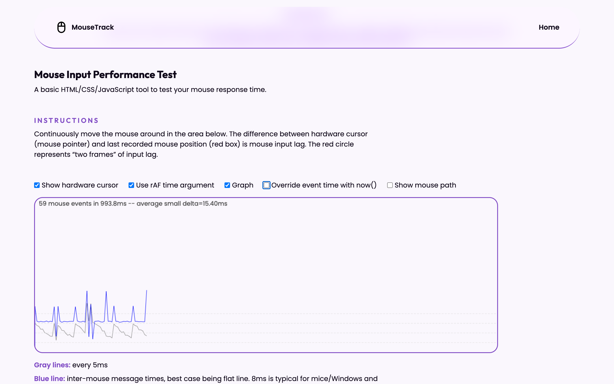

# MouseTrack: Mouse Input Performance Test &#128075;

Mouse input performance test inspired by https://www.vsynctester.com/testing/mouse.html by Jerry Jongerius!

## Purpose &#127919;
This site allows the user to test their mouse input latency with a graph to display feedback. There are five settings to choose from that allow the user to customize their test. I began this project after coming across the original site (linked in #attributions) while testing my new mouse's performance. When I took a look under the hood, I was inspired due to this being created from HTML, CSS, and vanilla JavaScript. The main goal was to rebuild the orignal app, modernize the JavaScript a bit, and redo the UI in my own style. I am super pleased with how it turned out. I'd love to hear feedback and suggestions as well!

## Where to View &#128187;
You can view the live site at: [https://rileybrickman.vercel.app/](https://rileybrickman.vercel.app/)

## Technologies used &#128640;
This site features HTML, CSS, and vanilla JavaScript. As my skill set continues to expand, I will be implementing new features, optimizations, and frameworks. 

## Planned changes &#128221;
- (MAYBE) Rebuild in React
- Further optimize codebase
- Add light/dark theme toggle

## Attributions &#128226;

- Original site: (https://www.vsynctester.com/testing/mouse.html).
- All icons from [Google Fonts](https://fonts.google.com/icons).
- "Poppins" font from [Google Fonts](https://fonts.google.com/specimen/Poppins).
- "Outfit" font from [Google Fonts](https://fonts.google.com/specimen/Outfit).
